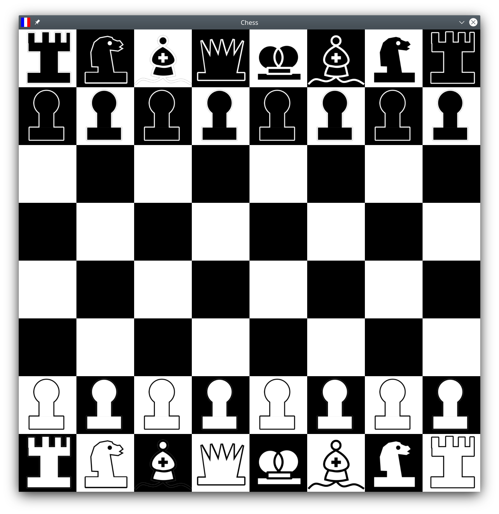

# Chess

A simple Chess game made in C++ and OpenGL with GLFW, GLAD, and GLM. It is a really random project that I made for no reason that has very bad code architecture. It has really basic chess rules and currently does not detect draws, stalemates, or checkmates. It supports board flipping because I added it for some reasons, but it's disabled by default because a lot of people (including [Anthony Huang](https://github.com/anthonyhuang07)) hated it.

## Gameplay

It's really simple. You start with a board and you drag pieces to move them around. The game automatically enforces some types of chess rules so you don't have to do that yourself. It currently only supports "local multiplayer", meaning multiplayer but with the two players playing from the same computer.

## Installing

Installing the chess game is really simple. Here are the different install instructions for you to install the chess game. Note that some of these instructions may be oriented towards developers and use some terms that a normal end user wouldn't understand.

If you would like to build this project from source instead for whatever reasons you have, go [here](BUILD.md) instead.

### Windows

If you're on Windows, all you need to do is go to the [release page](https://github.com/Hello56721/chess/releases) and download the latest version there. Once it's downloaded, extract the zip file and run `chess.exe` to play the game!

Please note that the release page is not updated as often as the main branch.

### Linux

Currently, there are no prebuilt binaries available for download for Linux systems (though that may change in the near future). For now, you'll just have to build this project from source.

### macOS

The chess program is currently not supported on macOS, since 

1. Apple deprecated the OpenGL API on all of their systems, including macOS. The chess program currently relies on the OpenGL API to do the rendering.
2. I don't have a Mac myself, so it's difficult for me to devleop and test on macOS.

That being said, if you're feeling adventurous, feel free to try and compile this codebase on macOS. Please note that I cannot guarantee that this code will work out of the box, so you might have to do some tinkering.

## Conclusion

Well, that's it. Not sure how to conclude a GitHub README, to be honest with you. Some people conclude it with a note on where to find documentation and stuff, but they aren't really relevant in this project. So, I guess I'll just end with goodbye and good luck.